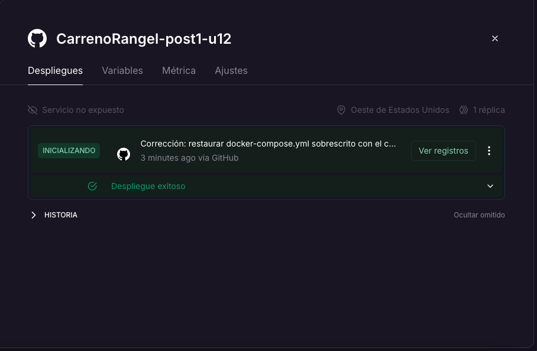
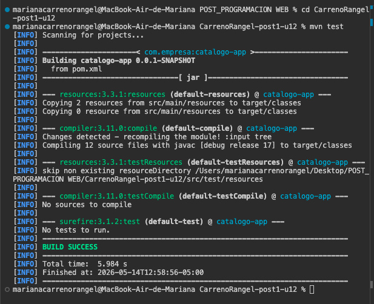
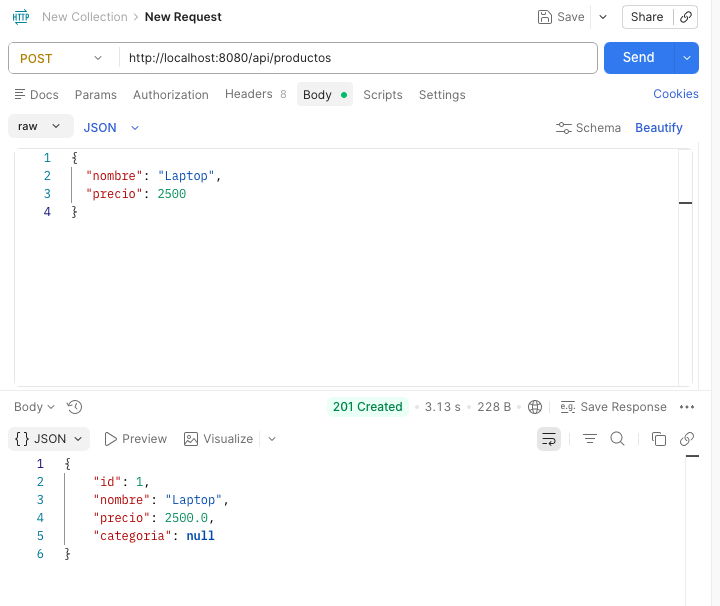

# CarrenoRangel-post1-u12
# API Catálogo de Productos

Aplicación desarrollada con Spring Boot para la gestión de productos mediante operaciones CRUD.

---

# URL de despliegue en Railway

https://TU-URL-DE-RAILWAY.up.railway.app

---

# Endpoints principales

## Obtener todos los productos

GET `/api/productos`

## Obtener producto por ID

GET `/api/productos/{id}`

## Crear producto

POST `/api/productos`

## Eliminar producto

DELETE `/api/productos/{id}`

---

# Capturas de pantalla

## Despliegue en Railway

---

## Endpoint POST funcionando en Postman

---

## Ejecución de pruebas Maven

---

# Variables de entorno configuradas en Railway

Para el despliegue de la aplicación se configuraron variables de entorno dentro de Railway.

Variables utilizadas:

| Variable | Descripción |
|---|---|
| PORT | Puerto asignado automáticamente por Railway |
| SPRING_PROFILES_ACTIVE | Perfil activo de Spring Boot |
| DATABASE_URL | URL de conexión a base de datos |
| DATABASE_USERNAME | Usuario de base de datos |
| DATABASE_PASSWORD | Contraseña de base de datos |

---

# Proceso de despliegue en Railway

1. Se creó el proyecto en Railway.
2. Se conectó el repositorio de GitHub.
3. Se configuró el Dockerfile para la compilación del proyecto.
4. Railway realizó automáticamente el build y despliegue.
5. Se verificó el estado “Despliegue exitoso”.
6. Se probaron los endpoints usando Postman.

---